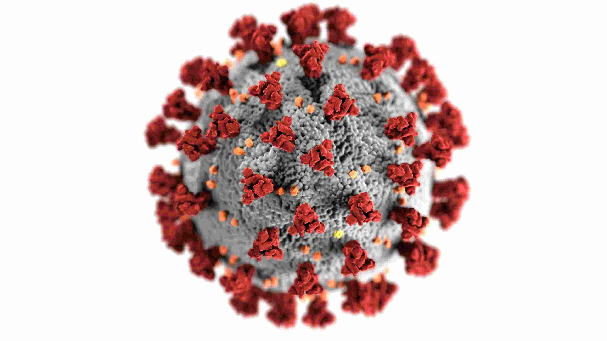
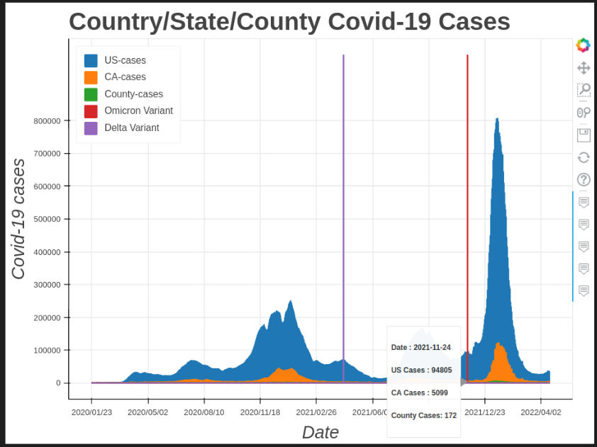
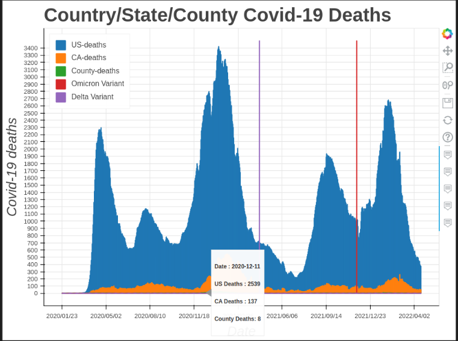
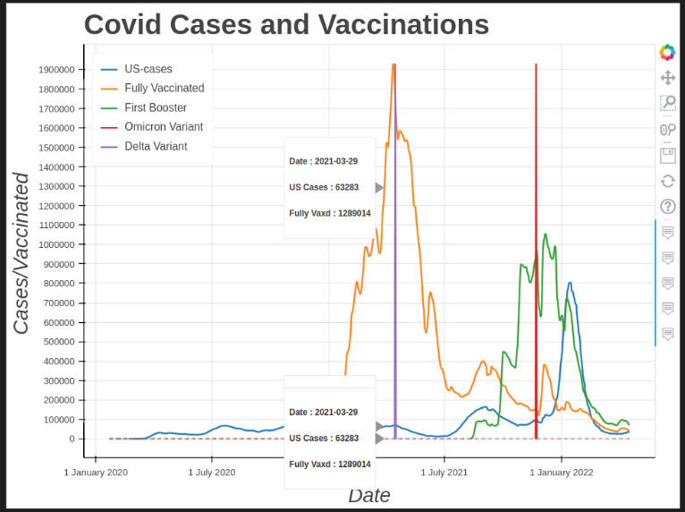

# Covid-19 Cases Visualization

I have been following the Covid-19 cases and death rate actively since January 2020. The first images that came out of China, when the world (especially US) was taking the virus casually, to now, when the hospitalizations are down. 
In the process I used a few epidemic trackers and followed a few authors:
1. Metabiota's [epidemic tracker](https://www.epidemictracker.com/): This company tracks diseases from Dengue to Covid-19 and was one of the few companies who raised the red flag as early as December 25th, 2019 (saying that something was terribly wrong in China)
2. Tomas Pueyo's articles on Medium: The most famous being [The Hammer and the Dance](https://tomaspueyo.medium.com/coronavirus-the-hammer-and-the-dance-be9337092b56). This was the first article that discussed the current scenarios and what countries can do to control the spread of the virus. Unfortunately the virus did spread and the lockdowns helped, but not so much. He followed this up with [Coronavirus: Learning How to Dance](https://tomaspueyo.medium.com/coronavirus-learning-how-to-dance-b8420170203e), [Coronavirus: The Basic Dance Steps Everybody Can Follow](https://tomaspueyo.medium.com/coronavirus-the-basic-dance-steps-everybody-can-follow-b3d216daa343)and [Coronavirus: How to Do Testing and Contact Tracing](https://tomaspueyo.medium.com/coronavirus-how-to-do-testing-and-contact-tracing-bde85b64072e)
3. BBC News: [Covid: World’s true pandemic death toll nearly 15 million, says WHO](https://www.bbc.com/news/health-61327778?utm_source=Nature+Briefing&utm_campaign=3b02233ccc-briefing-dy-20220505&utm_medium=email&utm_term=0_c9dfd39373-3b02233ccc-46571502)

## Here's how I obtained the datasets
1. I wanted to compare US-wide cases and deaths to California(The state I live in). The US and California data was obtained from the [CDC Covid tracker website](https://covid.cdc.gov/covid-data-tracker/#trends_dailycases_currenthospitaladmissions)
2. County wide data was procured from [California Health and Human Services Open Data Portal](https://data.chhs.ca.gov/dataset/covid-19-time-series-metrics-by-county-and-state/resource/046cdd2b-31e5-4d34-9ed3-b48cdbc4be7a). I searched for "Santa Clara" County to download my county's data.

## Did the various Covid-19 plots meet my expectation?
Here are the 3 plots that I really wanted to examine in depth. 

    
I wanted to see how the US country wide cases went, and compare them to California cases plot. Most ideally all the California numbers should be 1/50 (since it is one of the 50 states) of the total US cases but it was not so! The state fared well most of the time except around December 2020, January 2021 and January 2022.
Similarly, my county (Santa Clara County) is one 58 counties in the state of California. Santa Clara county did fairly well during December 2020 and January 2021, but after the schools repoened there was a sharp rise in covid cases.

    
Looks like California state fared much better than Country in terms of Covid deaths.

We can conclude that vaccinations were successfull!    
After the first doses of vaccination we can see that Covid cases began to subside and that helped get through the Delta variant.
The Omicron variant is highly transmissible and from the plot we can see that cases rose rapidly.
The good news is that as the booster dose became effective, the total covid cases began their downward trend.

## How to use:
1. Create a new conda environment using enivornment.yml
*     conda env create --file environment.yml
*     This will create covid19viz conda environment
2. Invoke the environment:
*     either with conda activate covid19viz
*     or select the covid19viz kernel in Visual Studio
